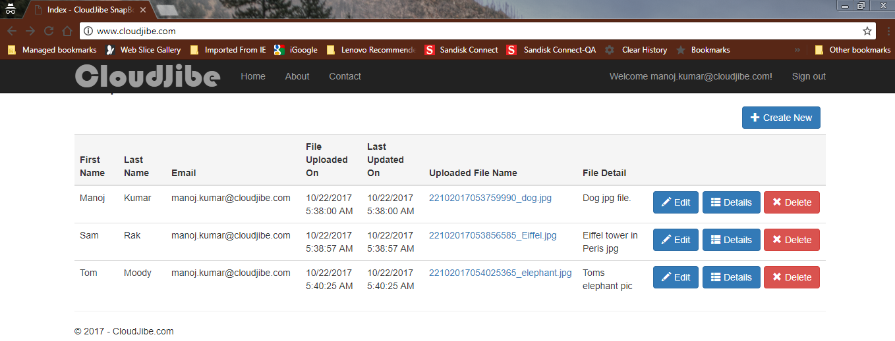
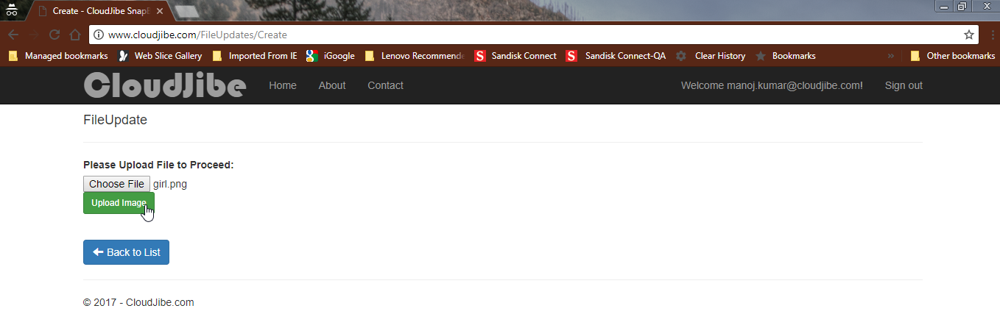
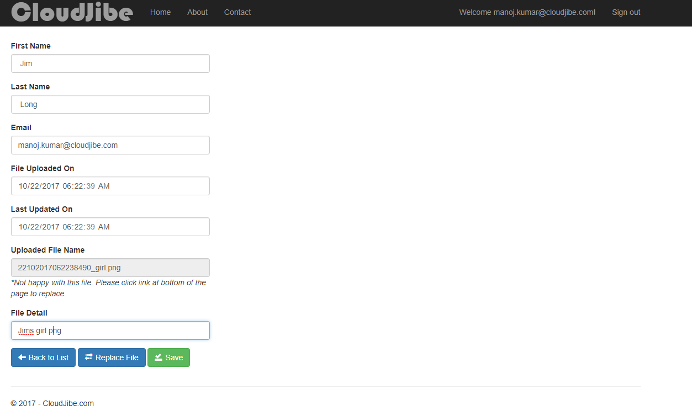
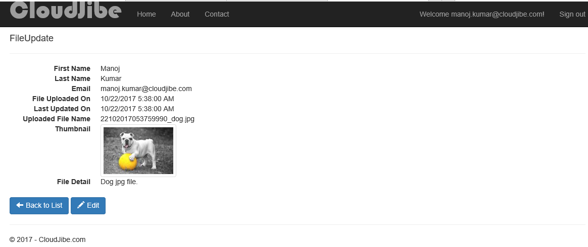
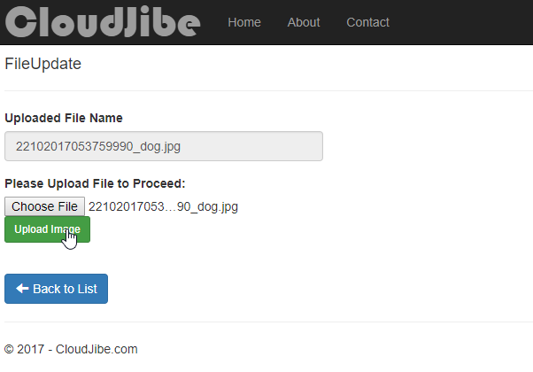
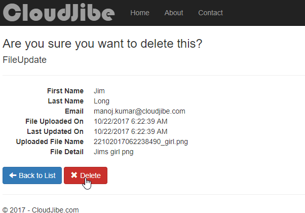
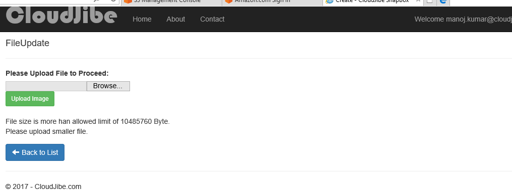
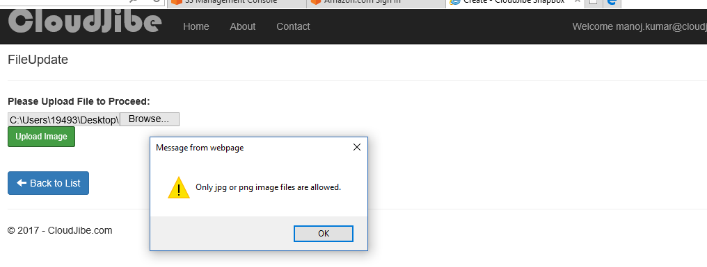
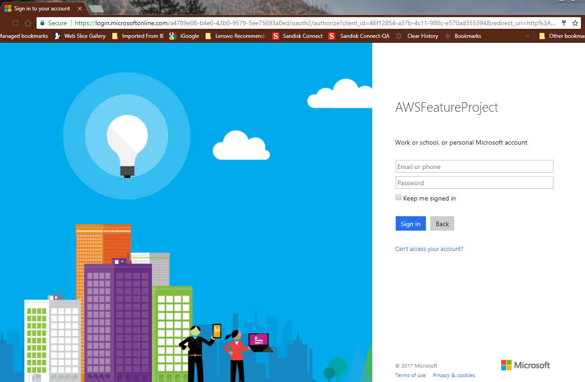
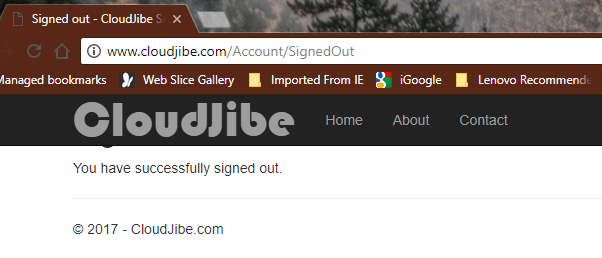

# SanapBox - AWSFeatureProject
####                                                                                                     By CloudJibe
## Introduction 
Personal picture repository in cloud. This application provides secure, highly available and scalable storage for you snaps.   

## Table of content
* Agenda
* Screenshots
* Installation
* AWS Infrastructure 
* Architecture diagrams
* Licence
* Refrence

## Agenda
Basically this application demonstrates Azure Active Directory Single Sign-On Authentication, CRUD operations with AWS RDS MySQL, File storage with AWS S3, File download from AWS CloudFront with AWS SDK for .NET with .NET Core, ASP.NET Core MVC, JQuery, Bootstrap, Pomelo.EntityFrameworkCore.MySql.

### Features
1.	Name: CloudJibe – SnapBox: Personal picture repository
2.	Provides Enterprise Level Azure Active Directory Single Sign On Authentication
3.	Secure highly available and scalable personal picture storage solution for employees
4.	Globally accessible. Individual roles restrict others to see your pictures.
5.	Picture metadata is stored in MultiAZ AWS RDS. User data is default populated from Azure AD.
6.	System allows jpg and png files to upload of max size of 10 MB.
7.	User can browse already uploaded pictures.
8.	User can update picture metadata or can replace picture too.
9.	User can delete file.
10.	System sends notification email on picture deletion using Lambda and SNS topic. 
11.	System keeps track of picture meta data like First Name, Last Name, Upload time, Updated time, Picture description.
12.	System provides list of pictures with link to download.
13.	System is deployed in Multi AZ Auto scaling environment.
14.	RDS is set to Multi AZ Deployment
15.	RDS is maintaining read replicas
16.	S3 is set for multi region replication with life cycle as in object storage diagram. Transfer acceleration is enabled for faster file transfer rate.
17.	Cloud from is set for caching and faster file downloads at edge locations.
18.	CloudWatch Alarm is set with SNS topic email notification on Elastic Beanstalk network traffic crosses threshold traffic.
19.	Site is also configured for HTTPs. Secure login using HTTPs


## Screenshots
#### Main List Page: In this page user can see list of images. which are stores in AWS S3 and metadata in AWSS RDS MySQL DB.


#### Upload image and Create image metadata Page: In this page user can upload picture and set metadata in subsequent page.



#### Detail Page: This page displays detail of image with thumbnail


#### Edit Page: In this page user can update metadat of image and can also replace it. Validation is inplace to keep file name same to replace.


#### Delete Page:


#### Validations: System has file type and file size validation



#### Sign in/Sign out Page: This application demonstrates Azure ADFS authentication.



## Installation
* Visual Studio 2017
* Clone project and open in Visual studio 2017
* Enter your RDS MySQL database connection string in Startup.cs file line # 29.
* Place IAM.json file in root folder where Startup.cs is there. This file will have you AWS profile information. Sample is as follows.

```
[local-test-profile]
aws_access_key_id=XXXXXXXXXXXXXZX
aws_secret_access_key=YYYYYYYYYYYYYYYYYYYYYYYYYYYYYY
region=us-west-1
```   

* Now run your application
* This project is deployed on AWS Elastic Beanstalk on Multi AZ servers with load balancer and autoscaling.

## AWS infrastructure 
 1. Create S3 bucket with name as “homework2-manoj”. Enable versioning and transfer acceleration. Lifecycle can be set as architecture diagram to save cost. I also set permissions, user and group in IAM. 

 2. Setup AWS Lambda to send delete image notifications using AWS Simple Notification Service Topic. 
Code for Lambda in NodeJS:

```
var AWS = require('aws-sdk');
var sns = new AWS.SNS();
console.log('Loading function');

exports.handler = (event, context, callback) => {
 var srcBucket = event.Records[0].s3.bucket.name;   
    // Object key may have spaces or unicode non-ASCII characters.
    var srcKey    =
    decodeURIComponent(event.Records[0].s3.object.key.replace(/\+/g, " ")); 
    console.log(
                    'Successfully resized ' + srcBucket + '/' + srcKey 
                );
    
var params = {
  Message: 'CloudJibe portal iniciated filedeletion for file - ' + srcBucket + '/' + srcKey, /* required */
  MessageStructure: 'STRING_VALUE',
  Subject: 'File ('+srcKey+') deleted in S3 from CloudJibe portal',
  TopicArn: 'arn:aws:sns:us-west-1:476342674:manojalb_health'
};
sns.publish(params, function(error, data) {
  if (error) console.log(error, err.stack); // an error occurred
  else     console.log(data);           // successful response
});

    //console.log('From SNS:', message);
    callback(null, 'Successfully resized ' + srcBucket + '/' + srcKey);
};
```


##Architecture diagrams


## License
The SnapBox – By CloudJibe is licensed under the terms of the GPL Open Source license and is available for free.
## Refrence
Manoj Kumar


